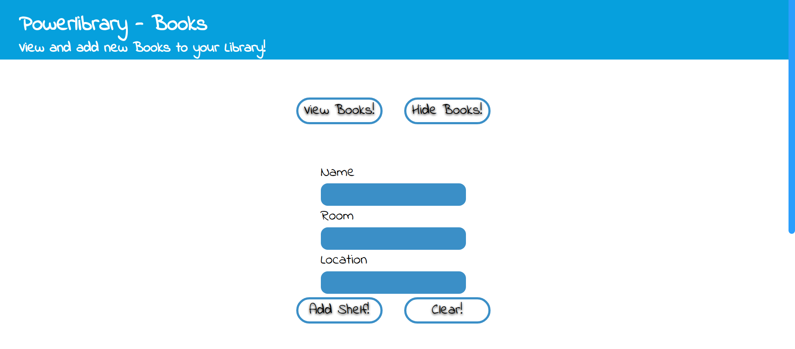
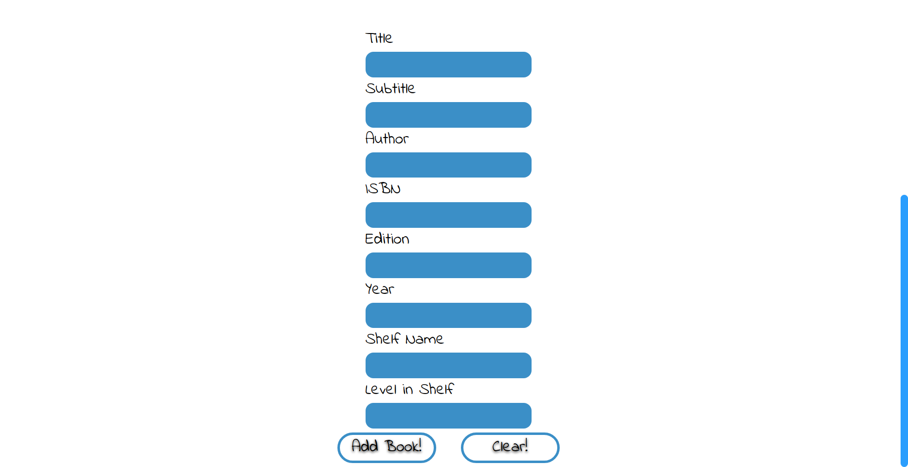
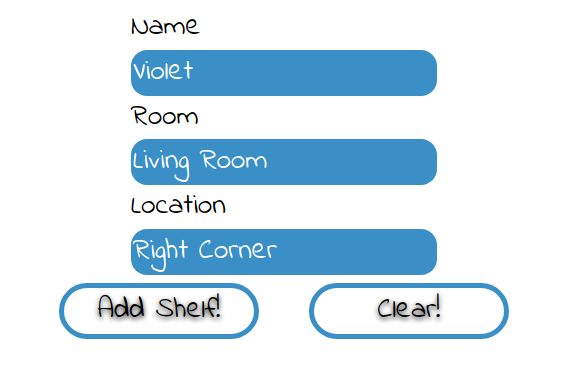
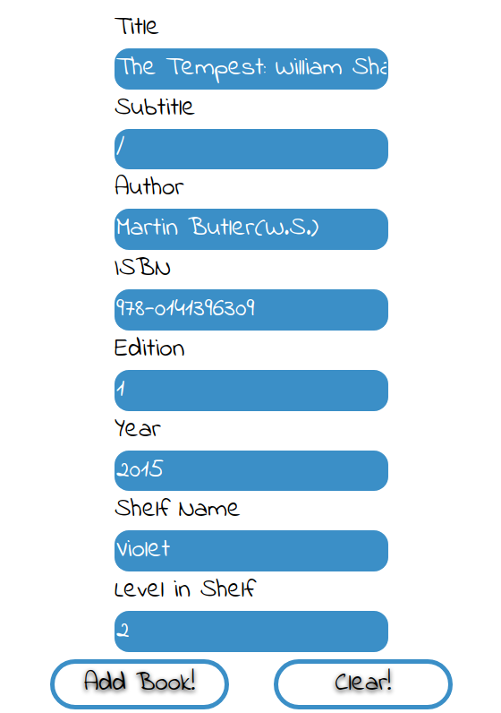
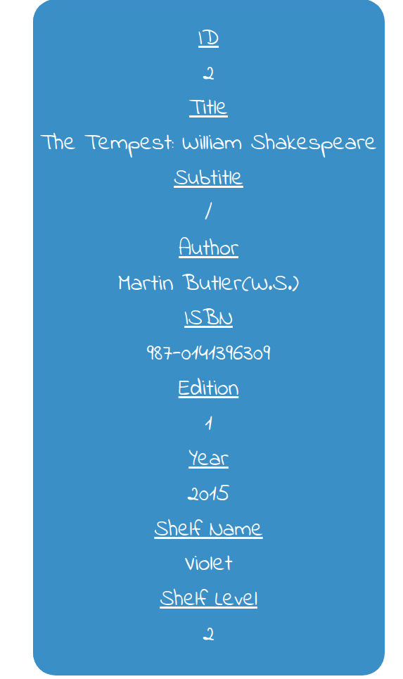

# ARCHIVED

# Powerlibrary

[![Author][contributors-shield]][contributors-url]
[![MIT+ License][license-shield]][license-url]

### Scenario: An example library use-case implementation based on a full-stack: React with Typescript as frontend, Golang as backend and PostgreSQL as a database in a microservice architecture. This app works with two entities or services in this case, the shelf service and the book service, the book service is managing the books and the shelf service the shelfs in which books can be put. It should be also possible to display the books and to see in which shelf they are, so that you never lose your book again in your tremendously large library at home.

## How to use it
You basically only need docker and kubernetes, e.g. minikube. Note that you also need an ingress controler. With docker you will build the images and with kubectl you will apply the yaml files in your kubernetes cluster. In this repo you find a folder services which contains two folders: books and shelfs. These are the services which we will deploy.
1. Build the docker images that we need. Inside of `services/books/database` we have to build the database image first in order to use it in the books backend pod: 
```bash
docker build -t pl-books-postgres:13 .
``` 
Inside of `services/books/backend` we have to build the backend docker image with: 
```bash 
docker build -t pl-books-v1 .
```
Then go to `services/books/frontend` in order to build the frontend image:
```bash
docker build -t pl-books-frontend-v1 .
```

2. If you use minikube, load the images into the minikube vm. For postgres the command is as follow
```bash
minikube image load pl-books-postgres:13
``` 
Do the same for the other images.

3. Go to `services/books/frontend` and execute the following command: 
```bash
kubectl apply -f pl-frontend-ingress
``` 
which will start an ingress server which will route the external traffic towards the appropriate backend server and also the frontend will be served to the client in that way.

4. Then execute: 
```bash
kubectl apply -f pl-books-frontend-service.yaml -f pl-books-frontend-service
``` 
in order to setup the React frontend.

5. In `services/books/backend` execute: 
```bash 
kubectl apply -f pl-books-pv -f pl-books-pvc -f pl-books-backend-service -f pl-books-backend-pod
``` 
to setup the books backend. We are finished with the books service, now lets do the same for the shelfs service.

6. First of all, we have to build the images again. Go inside of `services/shelfs/backend` and do 
```bash
docker build -t pl-shelfs .
``` 
and inside of `services/shelfs/database`:
```bash
docker build -t pl-shelfs-postgres:13 .
``` 
If you use minikube, do not forget to load the images as we did in step 2.

7. Now we can go inside of `services/shelfs/backend` and execute the following command: 
```bash
kubectl apply -f pl-shelfs-pv -f pl-shelfs-pvc -f pl-shelfs-backend-service -f pl-shelfs-backend-pod
``` 
and the shelf service is set up!

8. Use `kubectl get ingress` to retrieve the ip which you use for looking up the homepage of the app.


## Results
<div align="center">
  <h4>Homepage</h4>
  
  
</div>
<div align="center">
  <h4>Forms</h4>
  
  
</div>
<div align="center">
  
</div>

### Note
When using minikube it could be that your data inside of the databases get lost. A fix for that is not available for now but will perhaps come in the future.
  
[contributors-url]: https://github.com/RaphSku
[license-url]: https://github.com/RaphSku/TFWDA/blob/main/LICENSE

[contributors-shield]: https://img.shields.io/badge/Author-RaphSku-orange?style=plastic&labelColor=black
[license-shield]: https://img.shields.io/badge/License-MIT+-informational?style=plastic&labelColor=black
